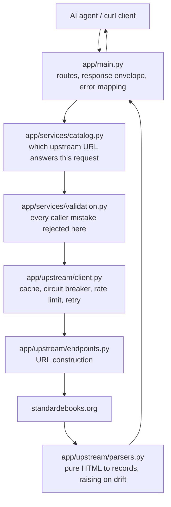

# Standard Ebooks Bridge

A read-only JSON API over the public [Standard Ebooks](https://standardebooks.org)
catalogue, which publishes no queryable API of its own.

**Use case.** An AI agent could call these endpoints to answer "what public-domain
books does Standard Ebooks have on this subject, by this author, and what does
the catalogue say about them?" without scraping HTML.

- **Six endpoints** — browse, search, one record, an author's works, subject
  facets, and health.
- **One upstream request per second**, a five-minute cache, and a circuit
  breaker that opens rather than hammering a site having trouble.
- **No credentials, no personal data, no writes.**
- **140 tests** (126 offline in 0.38s, 14 live) and a 70-check smoke test.

The site is a volunteer project whose `robots.txt` restricts a named group of
AI crawlers from full text and downloads, and ships a honeypot path that bans
the requesting IP. This bridge reads none of the restricted paths, identifies
itself, stays slow, caches hard, and reports a block instead of working around
one. See [Why this target](#why-this-target) — that decision is argued in full
in [`docs/TARGET_SELECTION.md`](docs/TARGET_SELECTION.md).

---

## Quick start

```bash
cp .env.example .env          # optional: every setting has a working default
make setup                    # create .venv (Python 3.11+) and install deps
make run                      # serve on http://127.0.0.1:8000
```

In another terminal:

```bash
make smoke                    # 70 checks against the running server
```

Or call it directly:

```bash
curl -s http://127.0.0.1:8000/health | python3 -m json.tool
curl -s "http://127.0.0.1:8000/v1/ebooks?page_size=3" | python3 -m json.tool
```

Interactive docs are at `/docs`, the schema at `/openapi.json`.

Without `make`, or with different tools:

```bash
python3 -m venv .venv && .venv/bin/pip install -e ".[dev]"
.venv/bin/uvicorn app.main:app --reload --host 127.0.0.1 --port 8000
```

## All targets

| Command | What it does |
| --- | --- |
| `make setup` | Create the virtualenv and install dependencies |
| `make run` | Start the API on port 8000 with reload |
| `make test` | Offline suite: 126 tests, no network |
| `make test-live` | Adds the 14 tests that hit the real site |
| `make smoke` | 70 live checks against a running server |
| `make lint` | `ruff check`, `ruff format --check`, `mypy` |
| `make format` | Apply ruff's fixes and formatting |
| `make openapi` | Write `docs/openapi.json` |
| `make scan` | Fail on secrets, credentials or personal e-mail addresses |
| `make clean` | Remove caches and the virtualenv |

---

## The API

Every success returns the same envelope:

```json
{
  "data": [ ... ],
  "meta": {
    "page": 1,
    "page_size": 12,
    "total": null,
    "source_url": "https://standardebooks.org/ebooks?view=list&per-page=12&page=1",
    "fetched_at": "2026-10-02T05:27:03Z",
    "cached": false
  }
}
```

Every failure returns one of five codes, with the same shape:

```json
{"error": {"code": "BAD_REQUEST", "message": "page must be at least 1", "retryable": false}}
```

| Code | Status | Retryable | Means |
| --- | --- | --- | --- |
| `BAD_REQUEST` | 400 | no | Your parameters are wrong |
| `NOT_FOUND` | 404 | no | No such record or endpoint |
| `RATE_LIMITED` | 429 | yes | Throttled, upstream busy, or breaker open |
| `UPSTREAM_BLOCKED` | 502 | no | The site refused automated access — **stop** |
| `UPSTREAM_CHANGED` | 502 | no | The site's HTML no longer matches — **report it** |

`meta.total` is `null` for paginated listings because the site publishes no
count and a guessed total would be a lie. `/v1/subjects` and
`/v1/authors/{slug}` return everything in one response, so they report a real
total.

### `GET /health`

Always `200`, so a monitor can read the body either way.

```json
{
  "data": {
    "status": "ok",
    "upstream_reachable": true,
    "circuit_breaker": "closed",
    "upstream_check_url": "https://standardebooks.org/ebooks?view=list&per-page=1&page=1",
    "service_version": "1.0.0"
  },
  "meta": { "page": null, "page_size": null, "total": null, "...": "..." }
}
```

The probe goes through the same cache, rate limit and breaker as real traffic,
so polling it cannot overload anything.

### `GET /v1/ebooks`

| Parameter | Default | Notes |
| --- | --- | --- |
| `page` | `1` | 1-based. `0` or negative → `BAD_REQUEST` |
| `page_size` | `12` | Ceiling 48 (`SE_BRIDGE_MAX_PAGE_SIZE`) |
| `subject` | — | A slug from `/v1/subjects`. Unknown → empty page, not an error |
| `sort` | `newest` | `newest`, `author-alpha`, `reading-ease`, `length`, `popularity` |

```bash
curl -s "http://127.0.0.1:8000/v1/ebooks?subject=science-fiction&sort=reading-ease&page_size=5"
```

Returns summaries: `id`, `title`, `authors`, `contributors`, `subjects`,
`word_count`, `reading_ease`, `cover_url`, `source_url`.

### `GET /v1/search`

Same parameters, plus a required `q`, and `sort` may also be `relevance`.
`q` must be non-blank and at most 200 characters. A query matching nothing is a
`200` with an empty list.

```bash
curl -s "http://127.0.0.1:8000/v1/search?q=shakespeare&page_size=5"
```

Search is substring matching over titles, authors and contributors — not
semantic. It will return books that merely mention your term.

### `GET /v1/ebooks/{ebook_id}`

`ebook_id` mirrors the site's own path tail:

```
edwin-a-abbott/flatland
thomas-a-kempis/the-imitation-of-christ/william-benham
```

Returns the full record: everything in the summary plus `abstract`,
`description`, `reading_time_minutes`, `difficulty`, `collections`, `language`,
`license`, `published_at`, `formats[]`, `read_online_url`, `sources[]` and
`source_repository_url`.

Identifiers are validated before any request leaves: uppercase, backslashes,
empty segments, `..`, over-long values and four-segment paths are all
`BAD_REQUEST` with no upstream call.

### `GET /v1/subjects`

The 19 subject slugs the catalogue can filter on, read from its filter form.

### `GET /v1/authors/{author_slug}`

Every ebook by one author in a single response. The site's author page ignores
`page` and `view` and always renders in grid mode, so these rows carry no
subjects or word counts — an upstream limit, documented rather than hidden.

```bash
curl -s "http://127.0.0.1:8000/v1/authors/dorothy-m-richardson"
```

---

## How it works



The client through the API and the politeness layer to the upstream parser and
the target site, and the response back:

```
caller
  │
  ▼
app/main.py              routes, response envelope, error mapping
  │
  ▼
app/services/catalog.py   which upstream URL answers this, and what meta.total may be
  │
  ▼
app/services/validation.py every caller mistake rejected here, before any request
  │
  ▼
app/upstream/client.py    cache → breaker → rate limit → request → retry
  │                        │
  ▼                        ▼
app/upstream/endpoints.py  app/upstream/parsers.py
URL construction          pure HTML → records, raising on drift
```

| Module | Responsibility |
| --- | --- |
| `app/config.py` | Validated settings; a bad `.env` fails at start-up |
| `app/errors.py` | The five codes and the exceptions behind them |
| `app/models.py` | Pydantic schemas that define the OpenAPI contract |
| `app/services/validation.py` | Page, page size, sort, slug, ID and query rules |
| `app/upstream/endpoints.py` | Every upstream URL, in one file |
| `app/upstream/parsers.py` | Pure functions: HTML in, records out |
| `app/upstream/client.py` | The only code that opens a socket |

Two boundaries carry most of the design. **Parsers are pure** — no I/O, no
settings, so they are tested directly against fixtures. **The client is the only
network code**, and it takes `transport`, `clock`, `wall_clock`, `sleeper` and
`random_source` as constructor arguments. That single seam is what lets 126
tests run offline in a third of a second, with exact timing assertions.

### Politeness

Applied in order on every request:

1. **Cache** — the exact URL, for 300 seconds. Bounded at 512 entries.
2. **Circuit breaker** — after 5 consecutive upstream failures, no requests for
   60 seconds; then one trial request decides whether to close again.
3. **Rate limit** — one second between outbound calls, process-wide.
4. **Retries** — `429` and `5xx` only, exponential backoff with equal jitter,
   honouring `Retry-After` in both seconds and HTTP-date form. Nothing else is
   retried.
5. **Blocks are reported, not handled** — `403` or a challenge page raises
   `UPSTREAM_BLOCKED` immediately. This client does not solve challenges,
   rotate addresses, or pretend to be a browser.

Requests carry an identifying `User-Agent` and never carry credentials or
cookies. Logs record paths and statuses, never response bodies or query
strings.

---

## Why this target

`Standard Ebooks` passed five gates: realistic browse/search/detail workflows,
no public API to use instead, permission in `robots.txt`, no personal data, and
public-domain content.

Rejected: **The Gazette** (statutory notices are full of real people's names and
addresses), **Craigslist** (its terms prohibit automated access), **OpenFlights**
(thin detail views), **Open Library** and **Project Gutenberg** (they have real
APIs — the wrong exercise).

The gap worth being explicit about: the site *does* publish OPDS feeds at
`/feeds/opds`, but they return `401` without membership credentials. Using them
would mean handling private credentials for a public catalogue, so this project
does not. Full reasoning in [`docs/TARGET_SELECTION.md`](docs/TARGET_SELECTION.md).

Two paths are deliberately never requested: `/honeypot`, which `robots.txt`
disallows and which bans the requesting IP, and `/about`, which lists real
patron names and is not needed for anything here.

---

## Ethics and compliance

The bridge reads public pages the way a slow, well-behaved visitor would, and it
stops where that stops. Specifically:

- **Only public content.** No login, no session cookies, no paywalled or
  members-only pages, and no OPDS feed that needs credentials.
- **No private or personal data.** Fixtures hold catalogue metadata only.
  `/about`, which lists real patron names, is never requested.
- **robots.txt is honoured.** Disallowed paths are not fetched, including the
  `/honeypot` path that bans the requesting IP.
- **A block is reported, never circumvented.** A 403 or a CAPTCHA page becomes
  `UPSTREAM_BLOCKED`. There is no proxy rotation, no header spoofing, no
  challenge solving and no open proxy surface. `robots.txt` restricts named AI
  crawlers from full text and downloads; this service never requests those paths
  and identifies itself honestly, accepting that the operator may block it.
- **Slow by default.** One request per second, a five-minute cache, backoff with
  jitter on 429 and 5xx, `Retry-After` honoured, and a circuit breaker that stops
  calling after repeated failures.
- **No copies, no writes.** Nothing is stored to disk, no catalogue mirror is
  built, and every response record carries its `source_url` so a caller can trace
  any fact back to the public page it came from.
- **No credentials anywhere.** There is no credential setting because there is
  nothing to authenticate to, and `make scan` fails the build on secrets,
  tokens or personal e-mail patterns.

Reading public pages is not the same as being authorised to republish them.
Anyone running this service carries that risk themselves; the honest long-term
answer is an official API, not a better crawler. See
[`docs/LIMITATIONS_AND_LONG_TERM_FIX.md`](docs/LIMITATIONS_AND_LONG_TERM_FIX.md).

---

## Assumptions

Made where the site was ambiguous, all cheap to reverse:

| Assumption | Why | If wrong |
| --- | --- | --- |
| `view=list` renders the fields this API returns | It is the denser layout; `view=grid` omits some | Switch `upstream/endpoints.py`; parsers already handle both |
| `per-page` accepts 12, 24 and 48 | Only these are offered by the site's own control | Extend the validation allowlist |
| A subject filter is the path `/subjects/{slug}` | The filter form submits `tags[]`, but that request 302s to the subject path, which is what the site's own links use | Prefix mapping in `endpoints.py` |
| An ebook id is one to three path segments | Detail URLs are `/ebooks/{author}/{title}[/{contributor}]` | Tighten the validator |
| Public sort vocabulary is `newest`, `author-alpha`, `reading-ease`, `length`, `popularity` | Taken from the site's own sort control | Update the mapping table |
| A missing optional field returns `null` | The site omits it, and inventing text would be a lie | — |
| Subject facets come from the listing page's `<select>` | That is where the site puts them | Fetch a facet page instead |

Deliberate scope decisions, recorded here because they look like gaps:
search is substring matching as the site implements it, not a ranking function;
`meta.total` is `null` for listings because the site publishes no count and the
bridge will not invent one; author pages always render grid mode, so they carry
no subjects or word counts.

---

## Project layout

```
.
├── app/
│   ├── main.py             FastAPI app, routes, envelope, error handlers
│   ├── models.py           Pydantic schemas and the error model
│   ├── config.py           Environment settings, validated at start-up
│   ├── errors.py           The five error codes and their exceptions
│   ├── services/
│   │   ├── catalog.py      Orchestration: URL selection, upstream-error mapping
│   │   └── validation.py   Page, sort, slug, id and query rules
│   └── upstream/           All site-specific logic lives here
│       ├── client.py       The only code that opens a socket
│       ├── parsers.py      Pure HTML → records, raising on drift
│       └── endpoints.py    Every upstream URL and parameter name
├── docs/
│   ├── TARGET_SELECTION.md        Why this site, and why not the others
│   ├── RECON.md                   Requests, endpoints, HTML mapping
│   ├── AGENT_USAGE.md             Per-endpoint tool reference
│   ├── LIMITATIONS_AND_LONG_TERM_FIX.md  The note: costs and the real fix
│   ├── LIMITATIONS.md             Implementation-level caveats
│   ├── TEST_RESULTS.md            Real test output and the scenario matrix
│   └── openapi.json               Exported OpenAPI 3.1
├── scripts/
│   ├── smoke_test.py      70 checks over HTTP against a running server
│   └── secret_scan.py     Fails on secrets and personal-data patterns
├── tests/
│   ├── fixtures/          12 recorded pages, trimmed, provenance documented
│   ├── test_parsers.py    Offline, against fixtures
│   ├── test_api.py        FastAPI with the upstream mocked
│   ├── test_politeness.py Fake clocks and scripted transports
│   └── test_live.py       Opt-in, skipped unless --live
├── .env.example           Every setting, placeholders only
├── Makefile               setup, run, test, smoke, lint, openapi, scan
├── pyproject.toml         Dependencies and tool configuration
└── prompt.md              The brief this project was built against
```

---

## Testing

```bash
make test          # 126 offline tests, no network, 0.38s
make test-live     # adds 14 tests against the real site
make run & make smoke   # 70 live checks over HTTP
make lint          # ruff + format check + mypy
make scan          # secrets and personal-data scan
```

Everything is injectable, so the offline suite is fully deterministic:
`FakeClock` for time, `RecordingSleeper` that advances the clock as a real sleep
would, and `FakeTransport` replaying scripted responses while recording every
URL that *would* have been requested.

Full results, the required-scenario matrix, and the eight defects these tests
caught are in [`docs/TEST_RESULTS.md`](docs/TEST_RESULTS.md). A step-by-step
guide to running every level yourself is in
[`docs/HOW_TO_TEST.md`](docs/HOW_TO_TEST.md).

---

## Configuration

All optional, all validated at start-up. See [`.env.example`](.env.example).

| Variable | Default | Effect |
| --- | --- | --- |
| `SE_BRIDGE_BASE_URL` | `https://standardebooks.org` | Upstream origin |
| `SE_BRIDGE_REQUESTS_PER_SECOND` | `1.0` | Outbound rate limit |
| `SE_BRIDGE_CACHE_TTL_SECONDS` | `300` | Cache lifetime; `0` disables |
| `SE_BRIDGE_USER_AGENT` | identifying string | Sent on every request |
| `SE_BRIDGE_MAX_ATTEMPTS` | `3` | Attempts per request, including the first |
| `SE_BRIDGE_CIRCUIT_FAILURE_THRESHOLD` | `5` | Failures before the breaker opens |
| `SE_BRIDGE_CIRCUIT_COOLDOWN_SECONDS` | `60` | How long it stays open |
| `SE_BRIDGE_MAX_PAGE_SIZE` | `48` | Page-size ceiling |
| `SE_BRIDGE_MAX_QUERY_LENGTH` | `200` | Longest accepted `q` |
| `SE_BRIDGE_LOG_LEVEL` | `INFO` | Log verbosity |

There is **no** credential setting, because there is nothing to authenticate to.

---

## Documentation

| Document | Contents |
| --- | --- |
| [`docs/TARGET_SELECTION.md`](docs/TARGET_SELECTION.md) | The five gates, the shortlist, why each rejection |
| [`docs/RECON.md`](docs/RECON.md) | Exact requests made, endpoints tried, HTML mapping |
| [`docs/AGENT_USAGE.md`](docs/AGENT_USAGE.md) | How an agent should call this, and what not to do |
| [`docs/LIMITATIONS_AND_LONG_TERM_FIX.md`](docs/LIMITATIONS_AND_LONG_TERM_FIX.md) | The note: what this approach costs and the real fix |
| [`docs/LIMITATIONS.md`](docs/LIMITATIONS.md) | 12 implementation-level limits and the proper fix for each |
| [`docs/TEST_RESULTS.md`](docs/TEST_RESULTS.md) | Test evidence and the required-scenario matrix |
| [`docs/HOW_TO_TEST.md`](docs/HOW_TO_TEST.md) | How to test this yourself, level by level |
| [`docs/openapi.json`](docs/openapi.json) | Exported OpenAPI 3.1 document |

## Licence

MIT. This service contains no copied site content — it parses and returns
metadata and public URLs at request time, and caches responses in memory only.